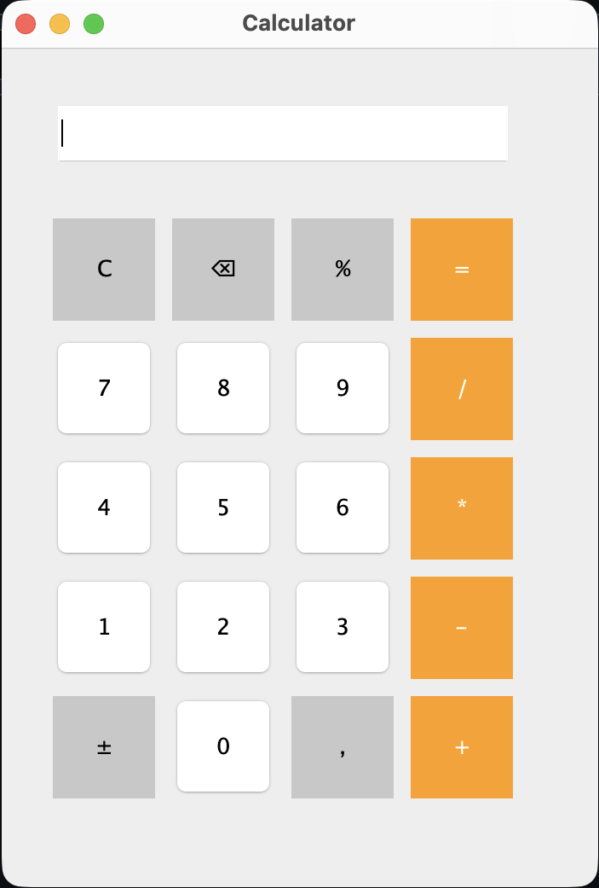

# 🧮 Calculadora Java

Uma calculadora desenvolvida em **Java Swing** como projeto de estudo para praticar conceitos de programação, lógica computacional, manipulação de eventos e construção de interfaces gráficas.

O projeto foi desenvolvido de forma incremental, começando com operações básicas e evoluindo para uma calculadora funcional com recursos adicionais e melhorias de organização de código.

---

## 📋 Funcionalidades

### Operações Básicas

- ➕ Soma
- ➖ Subtração
- ✖ Multiplicação
- ➗ Divisão

### Funcionalidades Extras

- Limpar visor (`C`)
- ⌫ : Apagar último caractere (`Delete`)
- ± : Alterar sinal do número
- % : Cálculo de porcentagem
- , : Suporte a números decimais
- Tratamento de divisão por zero
- Feedback visual ao selecionar operadores

---

## 🖼️ Interface



---

## 📂 Estrutura do Projeto

```text
java-calculator/
│
├── src/
│   └── Calculator.java
│
├── README.md
└── .gitignore
```

---

## ▶️ Como Executar

### 1. Clonar o repositório

```bash
git clone https://github.com/seu-usuario/java-calculator.git
```

### 2. Acessar o diretório

```bash
cd java-calculator
```

### 3. Compilar o projeto

```bash
javac src/Calculator.java
```

### 4. Executar a aplicação

```bash
java src.Calculator
```

---

## 🧠 Conceitos Praticados

Durante o desenvolvimento deste projeto foram aplicados diversos conceitos da linguagem Java:

- Estruturas condicionais
- Estruturas de repetição
- Arrays
- Métodos
- Manipulação de Strings
- Conversão de tipos
- Eventos com ActionListener
- Interface gráfica com Swing
- Tratamento de erros
- Refatoração de código
- Organização e documentação

---

## 📚 Objetivo do Projeto

Este projeto foi desenvolvido com fins educacionais para consolidar conhecimentos em Java e servir como base para versões mais avançadas da aplicação.

A evolução do projeto busca demonstrar não apenas a implementação de funcionalidades, mas também a melhoria contínua da organização, legibilidade e manutenção do código.

---

## 👨‍💻 Autor

**Marcelo Rian Bomfim Silva**

Estudante de Análise e Desenvolvimento de Sistemas e entusiasta do desenvolvimento de software.
